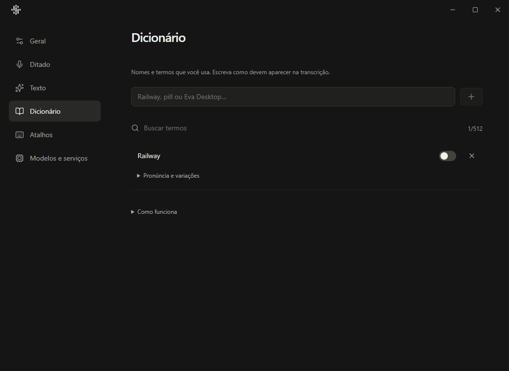

<p align="center">
  
</p>

# Clarify

[English](../README.md) · [Instalação](#instalação-no-windows) ·
[Como contribuir](../CONTRIBUTING.md) · [Segurança](../SECURITY.md)

Ditado para Windows, com modelos locais ou sua própria chave de IA. Fale,
revise e cole sem sair do aplicativo. O Clarify também reescreve e traduz
textos selecionados usando Gemini, OpenAI, Groq ou endpoints compatíveis.

> As Configurações e o dicionário descritos aqui fazem parte da v0.4.0.
> Consulte as [notas da versão](https://github.com/jvictormaynard/clarify/releases/latest)
> antes de baixar; versões anteriores têm uma interface diferente. A validação para publicação
> está descrita em [Release readiness](release-readiness.md).

## Principais recursos

- Transcrição e refinamento de voz com atalhos globais
- Reescrita segura de texto selecionado com verificação de foco
- Tradução de texto selecionado
- Integração nativa com atalhos e bandeja do Windows
- Interface QML em inglês, português, espanhol, alemão e russo;
  as novas Configurações usam português por enquanto
- Configurações em React/Tauri: Geral, Ditado, Texto, Dicionário, Atalhos e
  Modelos e serviços
- Gravação por alternância ou mantendo o atalho pressionado (Hold)
- Dicionário pessoal para nomes e termos técnicos
- Estatísticas locais sem armazenar o conteúdo das transcrições
- Sem conta Clarify, backend próprio ou telemetria

> [!IMPORTANT]
> A transcrição ou o refinamento em provedores cloud exige uma chave de API. O
> Local Whisper pode transcrever sem chave e baixa seus assets somente após uma
> ação explícita. As chaves e estatísticas ficam no seu computador. O áudio e o
> texto selecionado são enviados diretamente ao provedor configurado.

## Prévia da interface



Captura do frontend React da v0.4.0, em teste de navegador com dados fictícios.
Os testes da janela nativa e os cenários não testados estão registrados em
[Release readiness](release-readiness.md).

## Instalação no Windows

### Instalador Windows (em preparação)

O repositório já contém o contrato fail-closed do MSI e da atualização
autenticada, mas o recurso não deve ser publicado ou considerado pronto antes
dos gates de assinatura gerenciada, armazenamento seguro de credenciais,
proveniência e validação manual. Quando uma release futura incluir o arquivo
`Clarify-windows-x64.msi`, instale somente se o publisher Authenticode e o
SHA-256 corresponderem à release. Consulte [segurança da distribuição e das
atualizações](windows-distribution.md) para os comportamentos de instalação,
upgrade, reparo, rollback e desinstalação.

### Release portátil comunitária

O projeto também publica uma release comunitária sem custo para o aplicativo
portátil. Ela contém `Clarify.exe`, seu arquivo SHA-256, o SBOM de runtime,
um arquivo ZIP e os códigos-fonte verificados do SoX e do Qt/PySide. Os avisos
de licença estão incluídos no pacote portátil e no ZIP. Ela não possui assinatura
Authenticode enquanto não houver patrocínio para a assinatura paga. O
SmartScreen pode pedir confirmação no primeiro uso. Essa release não inclui o
MSI nem o manifesto de atualização autenticado.

### Executável portátil

1. Abra a [versão mais recente](https://github.com/jvictormaynard/clarify/releases/latest).
2. Baixe `Clarify.exe` e salve-o em uma pasta sob seu controle.
3. Abra o executável.
4. Abra **Configurações → Modelos e serviços** e escolha um caminho:
   - **Cloud:** selecione Gemini, OpenAI, Groq ou um endpoint compatível,
     informe a chave de API e valide o provedor.
   - **Local Whisper:** revise os requisitos e instale o modelo escolhido. A
     transcrição local não exige chave. O refinamento cloud é opcional e pode
     ser ativado com **Allow cloud refinement**.
5. Abra **Configurações → Ditado** ou **Configurações → Texto** para
   escolher a rota de cada workflow. Cada rota pode ter seu próprio provedor,
   modelo, endpoint, estado e prompt.

Os executáveis portáteis comunitários não possuem assinatura de código. Confira
o arquivo SHA-256 publicado com a release antes de executar o download. O MSI e
o caminho de atualização no aplicativo permanecem desativados até que os gates
da release assinada sejam concluídos.

Para executar o código-fonte com as novas Configurações:

```powershell
git clone https://github.com/jvictormaynard/clarify.git
cd clarify
.\scripts\setup.ps1 -Dev
.\scripts\build-settings.ps1
$env:CLARIFY_SETTINGS_EXECUTABLE = (Resolve-Path .\dist\clarify-settings.exe).Path
.\start.bat
```

É necessário ter Windows 10 ou 11, Python 3.11 ou mais recente e um microfone.
O build das Configurações exige Node.js 22, Rust MSVC, Visual Studio C++ Build
Tools e Windows SDK. A janela usa o Microsoft Edge WebView2. O usuário do
executável pronto não precisa de Python, Node.js ou Rust.
Na primeira execução, o script cria um ambiente virtual e instala as
dependências automaticamente.

## Atalhos

| Atalho | Ação |
| --- | --- |
| `Alt + L` | Iniciar ou encerrar a gravação |
| `Esc` | Cancelar a gravação ativa |
| `Alt + K` | Reescrever o texto selecionado |
| `Alt + T` | Traduzir o texto selecionado |
| `Alt + V` | Gravar e traduzir a fala |
| `Alt + R` | Mostrar ou esconder o Clarify |

Os cinco atalhos globais podem ser capturados, validados e redefinidos em
**Configurações → Atalhos**. No modo Hold, mantenha o atalho pressionado para
gravar e solte para finalizar. `Esc` cancela mesmo enquanto o atalho está
pressionado. O botão de microfone da pill continua funcionando por clique.
O aviso de cancelamento e a opção Desfazer aparecem na própria pill.
Não há janela automática de resultado. Quando a colagem não é segura, o texto
fica na área de transferência. O menu da pill permite colar a última
transcrição da sessão.

## Provedores e rotas de workflow

Um **provider** é o serviço e suas credenciais. Uma **route** define como cada
workflow usa esse serviço: provedor, modelo, endpoint, ativação e prompt. Os
providers são configurados em **Configurações → Modelos e serviços**; as rotas ficam em
**Configurações → Ditado** e **Configurações → Texto**. O Local Whisper
usa um sidecar local e não exige chave para transcrição.

## Dicionário pessoal

Em **Configurações → Dicionário**, adicione termos como `Railway`, `pill`, `Lana`
ou `Eva Desktop`. Cada termo pode ser editado, desativado ou removido. A barra
de salvar e descartar aparece após uma alteração.
Os termos ativos entram como contexto limitado no ASR e na revisão opcional.
Eles ajudam o modelo; não garantem uma substituição. Em uma rota na nuvem,
esse vocabulário também é enviado ao provedor. Veja as etapas e os limites no
[guia do dicionário](dictionary-snippets.md).

## Privacidade

O Clarify não possui servidor próprio. As configurações e estatísticas
locais ficam em `%APPDATA%\Clarify`. No Windows, as chaves ficam separadas
em `secrets.dpapi.json`, criptografadas pela DPAPI para o usuário atual. Chaves
antigas em texto simples são migradas e só são removidas de `config.json` depois
da confirmação da cópia protegida. Variáveis de ambiente são substituições
temporárias e não são persistidas.

O dicionário fica em `dictionary.json`. O histórico de transcrições é opcional.
A gravação usa um WAV temporário, removido após o processamento normal.
Falhas de limpeza ou encerramento forçado podem deixar arquivos no disco.
Não há garantia de exclusão segura.

Excluir somente o executável não apaga os dados. Para remover também as
credenciais, exclua `secrets.dpapi.json` ou toda a pasta de dados do
Clarify. Em execuções experimentais no Linux/macOS, `secrets.json` é um
fallback em texto simples com permissões restritas; não compartilhe esse arquivo.

## Desenvolvimento e contribuição

A documentação técnica principal está em inglês para facilitar a colaboração
internacional:

- [Guia de contribuição](../CONTRIBUTING.md)
- [Ambiente de desenvolvimento](development.md)
- [Arquitetura](architecture.md)
- [Dicionário local e snippets](dictionary-snippets.md)
- [Microfones e limites de gravação](microphone-controls.md)
- [Suporte](../SUPPORT.md)
- [Política de segurança](../SECURITY.md)

O código do Clarify usa a [Licença MIT](../LICENSE). O SoX e outras
dependências mantêm suas próprias licenças, documentadas em
[THIRD_PARTY_NOTICES.md](../THIRD_PARTY_NOTICES.md).

### Desempenho dos modelos locais

Instale o modelo uma vez para preparar CPU e GPU NVIDIA compativel. O modo
Automatic mede este computador e usa o dispositivo mais rapido. O arquivo do
modelo e reutilizado entre os modos. Instalacoes existentes podem usar Optimize
CPU/GPU. Base, Small e Medium oferecem perfis diferentes de velocidade e memoria.
O processamento durante pausas e experimental e fica desativado por padrao.
O refinamento na nuvem da transcricao local continua sendo uma opcao explicita.

Se a revisão opcional do ditado falhar, o Clarify preserva a transcrição original, mostra um aviso breve e registra resultado parcial quando o histórico local está ativado.
O ditado usa o refinamento fiel como comportamento padrão, sem seletor de modo.
Configurações antigas de modo são migradas automaticamente. O refinamento em
nuvem de transcrições locais continua dependendo da autorização nas configurações.
